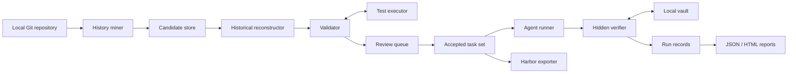

# Architecture

RepoTrials is a local-first pipeline, not a hosted benchmark service. It converts selected historical fixes into private task bundles, evaluates command-line agents, and produces auditable reports.

This document describes the v0.1 component boundaries. It is an architectural contract, not a promise that every future adapter will use the same internal classes.

## Goals

- Mine useful tasks without uploading the target repository.
- Keep later history, hidden tests, and reference patches away from the agent.
- Prefer deterministic execution evidence over commit-message heuristics.
- Preserve enough provenance to reproduce or reject every candidate.
- Support any agent that can be launched as a local command.
- Keep core runtime dependencies at zero in v0.1.
- Export accepted tasks for a broader runner without requiring that runner locally.

## Non-goals

- A general-purpose container sandbox.
- Automatic proof that a task is fair or behaviorally complete.
- Reconstruction of every historical language/toolchain combination.
- A hosted task registry or leaderboard.
- A replacement for Harbor, SWE-bench, or training-data generators.

## Component view



### History miner

The miner enumerates reachable Git history and applies cheap, deterministic filters before any tests are run. It looks for a historical change with both implementation and Python-test modifications. Surviving v0.1 candidates retain the revisions, changed-path classes, line counts, and first-parent metadata needed for inspection; static filters reduce the candidate count before execution.

Commit messages help produce a reviewable draft description; they are not correctness evidence. v0.1 does not require a GitHub account or API.

### Candidate store

Candidate records contain repository-relative metadata, parent/fixed revision identities, patch classification, and discovery diagnostics. A candidate is not yet an evaluation task.

The store must distinguish:

- a discovery decision;
- an execution-validation decision; and
- a human-review decision.

Conflating these states makes failed or ambiguous candidates difficult to audit.

### Historical reconstructor

The reconstructor materializes the pre-fix tree from Git and derives two artifacts from the historical change:

- the **test patch**, which becomes verifier material; and
- the **gold patch**, which is used only to prove that the historical fix satisfies the reconstructed tests.

The agent receives an exported work tree, not the source repository's later Git history. Reconstruction must use explicit revisions and repository-contained paths; it must not resolve a user-controlled path outside the task root.

The v0.1 export is a `git archive` snapshot rather than a faithful checkout. It can honor historical `export-ignore` attributes and therefore omit tracked paths; it does not reconstruct submodule contents, hydrated Git LFS objects, or repository symlinks. Such candidates are outside the supported reconstruction boundary and should be rejected during review.

v0.1 freezes the submission file set to the implementation paths changed by the historical fix. Local verification and Harbor export use that same exact allowlist. This keeps the oracle boundary simple and auditable, but can reject an alternative correct design that introduces a new helper path; it is a documented coverage limitation rather than a behavioral scoring rule.

### Test executor

The executor installs or invokes the target repository's configured Python test command and normalizes process results. In v0.1, it is a local process boundary, not a security boundary.

The v0.1 executor captures:

- command and working directory;
- duration;
- exit status or timeout;
- captured standard output/error;
- test identifiers and statuses when configured JUnit XML is available.

### Validator

The validator evaluates the BASE, RED, and GOLD states described in [methodology.md](methodology.md); RED also represents the historical no-op submission. It fails closed when a patch cannot be applied, a required test is absent, output is unparseable, or the gold state remains failing.

Execution validity is necessary but insufficient. A stable red/gold transition can still encode an underspecified or overly implementation-specific task.

### Review queue

Review is the trust-upgrade boundary. The plain CLI table is only a triage view; JSON output plus the source diff and stored validation evidence provide the material for an external review process.

v0.1 stores `auto`, `verified`, and `rejected` tiers plus a review timestamp. It does not store reviewer identity or rationale and does not provide a tamper-proof signature system. Editing a task's prompt, hidden tests, base revision, or environment after acceptance invalidates the review and should cause revalidation.

### Vault and hidden verifier

The vault stores verifier-only artifacts such as hidden test patches and gold patches. The runner supplies the agent with a separate workspace and invokes the verifier only after the agent has finished.

The vault provides **workspace separation**, not cryptographic secrecy and not hostile-process containment. A process with the same host privileges may still be able to inspect unrelated files. Operators needing a hard boundary must place the agent in a VM/container with a narrow mount and no vault access.

### Agent runner

The runner starts a configured command, provides the task prompt and workspace through the documented command contract, enforces configured time limits, and captures the resulting patch and run metadata.

RepoTrials does not assume a particular model API or agent framework. A command may invoke a local model, a hosted service, or another harness. Results retain the human label and a SHA-256 digest of the command; operators must preserve the full command and any provider-side settings separately when reproducibility requires them.

### Reporter and comparator

Reports are projections of stored run records. JSON is the interchange format; HTML is a local inspection artifact. The runner writes an atomic `running` group manifest before attempts and marks it `complete` only with the exact expected run IDs. A report selector must resolve to one complete run group; partial or mismatched groups fail closed. The comparator requires one group on each side and checks identical task IDs, portable task-content and task-contract digests, attempt shapes, and recorded execution profiles before computing task-level deltas. Selectors may be a run ID, agent label, or run-group ID; a reused label is rejected when it spans groups. Provider-side settings not captured in the execution profile remain the operator's responsibility.

### Harbor exporter

The exporter maps accepted RepoTrials tasks into a [Harbor](https://github.com/harbor-framework/harbor)-compatible directory layout. Harbor is an optional downstream runner and is not required for explicitly acknowledged unsafe local generic-command execution. Tasks frozen with the Harbor execution backend cannot be run through the local command path.

Export must not accidentally copy the entire vault or gold patch into an agent-visible task directory. The generated task gives the agent a synthetic one-commit Git repository and stores that commit's SHA outside the work tree. After the agent phase, a bounded `[[verifier.collect]]` hook in the stable Harbor v0.20.0 schema-1.3 export uses the stored SHA—not a possibly agent-moved `HEAD`—to create `/tmp/agent.patch`, a full-index binary patch of the complete workspace diff. This includes uncommitted and committed additions, modifications, and deletions. Harbor transfers that patch—not the raw agent workspace—to a separate no-network verifier. The verifier starts from a clean base, rejects the submission if any captured path is outside the exact frozen allowlist or protected, rechecks its size limits, applies the hidden test overlay, reruns frozen setup, and runs evaluator-owned tests. This handoff preserves deletion and commit semantics without exposing verifier material to the agent.

## Data flow and state transitions

```text
discovered
    -> rejected_static
    -> pending_validation
        -> rejected_execution
        -> quarantined_unstable
        -> pending_review
            -> rejected_review
            -> accepted
                -> exported
                -> evaluated
```

This is the logical lifecycle; not every rejection is persisted as a first-class record in v0.1. Re-running mining may discover the same historical pair, but its identity is derived from the parent/fixed revision pair rather than list position.

## Trust boundaries

There are four materially different zones:

1. **Source repository:** trusted only as data during mining; its build/test scripts become arbitrary code when executed.
2. **Agent workspace:** assumed observable and writable by the agent; must not contain later history or verifier material.
3. **Verifier workspace:** contains the candidate patch plus hidden tests; must be reconstructed fresh rather than reused from the agent process.
4. **Vault/report store:** contains sensitive artifacts and possibly source/output excerpts; must not be broadly mounted or published.

See [threat-model.md](threat-model.md) for threats and operator responsibilities.

## Reproducibility model

RepoTrials does not identify an evaluation by its display name alone. A reproducibility record should include:

- task schema version, frozen execution contract, and portable content digest;
- base revision/tree identity;
- test and gold artifact digests;
- test command and timeout;
- RepoTrials revision;
- Python, OS, and architecture;
- relevant dependency/lockfile digests;
- agent command and label; and
- prompt/tool/budget metadata supplied by the operator.

Validation freezes the effective task contract, including test commands, path policies, limits, environment requests, and expected tests. The task identity binds that contract and content-addressed artifacts. Run records include a portable digest of execution-relevant task semantics, and comparison enforces equality of those per-task digests. v0.1 does not compute one aggregate task-set digest; published evaluations should compute and retain one separately when needed.

## Extension points

Future language/test adapters should provide a narrow contract for:

- repository detection;
- implementation/test path classification;
- environment discovery;
- test invocation;
- normalized test-result parsing; and
- protected path policy.

Adapters must not weaken verifier separation or redefine a missing test as success.
