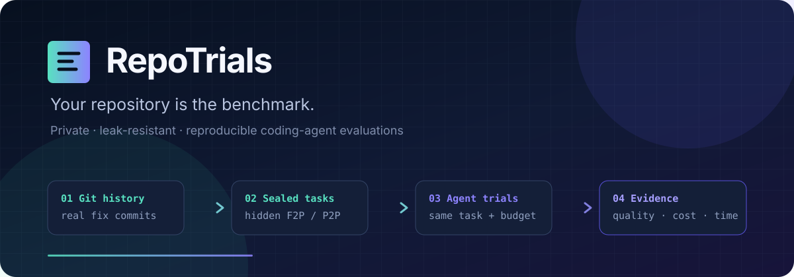

---
hide:
  - navigation
---

# RepoTrials



**SWE-bench for your own repository: mined from your Git log, graded on your machine.**

RepoTrials finds the commits where your team fixed a bug and added a test, rewinds the
repository to the moment before the fix, hides the test, and scores any command-line agent on
whether it can pass it. Python repositories, pre-release v0.1, zero runtime dependencies,
nothing uploaded.

```text
real fix commit → sealed historical task → equal agent trials → hidden verifier → evidence
```

## See it work before you decide to trust it

No clone, no config file, no API key, no Docker:

```bash
uvx --with pytest --from git+https://github.com/PozziTiv4ik/Repo-Trials repotrials demo
```

```text
noop-agent  0/1 trials resolved
fix-agent   1/1 trials resolved
delta       +100 percentage points
```

In about four seconds that builds a real two-commit Git repository, mines it, runs BASE/RED/GOLD
validation, scores one deliberately broken agent and one working agent against the same sealed
task, and leaves a self-contained HTML report on disk. The full transcript, and the same pipeline
pointed at a repository you care about, are in the [Quickstart](quickstart.md).

[Quickstart](quickstart.md){ .md-button .md-button--primary }
[Wire up your agent](agents.md){ .md-button }

## Why this exists

A public leaderboard tells you which agent is stronger in general across a handful of public
Python projects. It cannot tell you whether a given agent, model tier, prompt, or permission mode
works on *your* 400k-line internal service, with your fixtures, your test harness, and your
team's idioms. RepoTrials changes only the corpus: yours, private, and regenerable as your
history grows.

<div class="grid cards" markdown>

-   **Graded on behavior, never on diff similarity**

    ---

    RepoTrials parses JUnit XML from the actual test run and checks every recorded outcome
    against the task's frozen `FAIL_TO_PASS` and `PASS_TO_PASS` sets. A task is resolved only
    when every fail-to-pass test passes and every protected regression test still passes. A patch
    that looks nothing like the human fix scores exactly the same as one that matches it
    character for character.

    [Scoring rules](methodology.md#scoring-and-comparison)

-   **The oracle never enters the agent's workspace**

    ---

    The agent gets a `git archive` export of the base tree wrapped in a fresh one-commit
    synthetic repository: no later history, no original commit IDs, no remotes, no gold patch,
    no hidden tests. Those live in a content-addressed local vault and are applied afterwards, in
    a separate verifier workspace, by evaluator-owned commands.

    [Trust boundaries](architecture.md#trust-boundaries)

-   **Any agent that is a shell command**

    ---

    `--agent-command "..."` is the whole integration surface. No plugin, no SDK, no adapter to
    write, and RepoTrials itself never contacts a model provider or a hosted service. If your
    scaffold can be started from a terminal and edit files in a directory, it can be benchmarked.

    [Agent contract](agents.md)

-   **Comparisons that refuse to lie to you**

    ---

    Every run gets a run-group identifier, a task-content digest, a task-contract digest, and an
    execution-profile hash. `compare` rejects two cohorts unless their task sets, digests,
    attempt shapes, and execution profiles match. An ambiguous or incomplete run group is an
    error rather than a silent average.

    [Comparison records](task-format.md#comparison-records)

</div>

## The pipeline

```text
Git history
    -> static candidate discovery        repotrials mine
    -> historical reconstruction         repotrials validate
    -> patch split (hidden test / gold)
    -> BASE/RED/GOLD validation
    -> human review                      repotrials review --verify
    -> private task set
    -> agent runs                        repotrials run --agent-command ...
    -> JSON/HTML reports                 repotrials report / compare
       or Harbor export                  repotrials export-harbor
```

For a base revision `B`, hidden test patch `T`, and historical gold patch `S`, a candidate
becomes a task only when all three executions agree:

```text
BASE   B       + original tests   -> pass
RED    B       + T                -> at least one relevant failure
GOLD   B + S   + T                -> pass
NOOP   B       + T                -> not resolved
```

## Status and scope

!!! warning "Pre-release v0.1"

    RepoTrials is under active development. Command names and the task schema may change before
    the first stable release. It is not published on PyPI yet; install from source. Do not use
    current scores as a security or procurement certification.

What v0.1 explicitly does **not** claim:

- It does not prove that every mined task is fair or fully specified. Human review remains part
  of the trusted workflow, and validated tasks land in tier `auto`, not `verified`.
- It does not yet accept every behaviorally valid patch shape. v0.1 freezes the editable
  source-file set to the paths touched by the historical human fix, so a solution that adds a new
  helper path is rejected even when its behavior would be correct.
- It does not guarantee freedom from model-training contamination, especially for public
  repositories.
- It does not support every language, test runner, monorepo, service dependency, or historical
  build environment. The supported v0.1 stack is Git plus Python tests that emit JUnit XML.
- It does not reconstruct a complete Git checkout. v0.1 snapshots with `git archive`, so
  `export-ignore`, submodules, hydrated Git LFS objects, and repository symlinks are unsupported.
- It is not a hardened sandbox for hostile code. Repository tests and agent commands are
  arbitrary programs; run them in an isolated environment.
- It does not upload repositories, tasks, or results to a hosted service.

The [FAQ](faq.md) answers these one at a time, including the ones that are genuinely
uncomfortable. Read the [threat model](threat-model.md#v01-security-statement) before evaluating
untrusted agents or repositories.

## Where to go next

| If you want to… | Read |
|---|---|
| See a real red-to-green delta in a few seconds | [Quickstart](quickstart.md) |
| Decide whether a different tool suits you better | [How it compares](comparison.md) |
| Attach Claude Code, Codex, Aider, or your own scaffold | [Agents](agents.md) |
| Gate a pull request on an agent regression | [CI](ci.md) |
| Tune globs, setup, test command, and budgets | [Configuration](configuration.md) |
| Understand what a score does and does not mean | [Methodology](methodology.md) |
| Know exactly what the agent can see | [Architecture](architecture.md) and [Threat model](threat-model.md) |
| Read the JSON contracts before automating | [Task format](task-format.md) |

Licensed under the [Apache License 2.0](https://github.com/PozziTiv4ik/Repo-Trials/blob/main/LICENSE).
